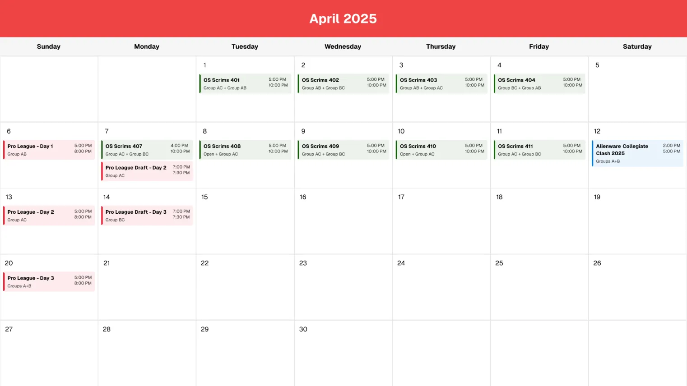

# Apex Calendar Bot

<div align="center">
  
  <br>
  <br>
  <a href="https://discord.com/api/oauth2/authorize?client_id=1095418638200209559&permissions=92160&scope=bot%20applications.commands">
    
  </a>
  <br>
  <br>
  <a href="https://raw.githubusercontent.com/AugusDogus/apex-calendar/refs/heads/main/.github/assets/example.png">
    
  </a>
</div>

## About

Apex Calendar Bot is a Discord bot that helps you keep track of Apex Legends events by displaying and automatically updating a calendar in your server. The bot fetches event data from [Oversight Esports](https://oversightesports.com/calendar/) and renders a beautiful calendar view that updates periodically.

## Features

- 📅 Displays a beautiful calendar of Apex Legends events
- 🔄 Automatically updates calendar information
- 🎮 Shows event details including times and descriptions
- 🌍 Configurable timezone support
- 🔒 Secure command system with permission controls

## Quick Start

1. [Click here to invite the bot](https://discord.com/api/oauth2/authorize?client_id=1095418638200209559&permissions=92160&scope=bot%20applications.commands) to your server
2. Create a channel for the calendar
3. Use `/start` in the desired channel
4. Done! The bot will automatically keep the calendar updated

## Commands

- `/start` - Start calendar monitoring in the current channel
- `/stop` - Stop calendar monitoring (with optional message deletion)
- `/refresh` - Manually refresh the calendar

All commands require the `Kick Members` permission to use.

## Self-Hosting

The recommended way to self-host the bot is using our pre-built Docker image. This ensures you're running the same version as our hosted bot and simplifies the setup process.

```bash
docker run -d \
  -e DISCORD_TOKEN=your_bot_token \
  -e DATABASE_PATH=/data \
  -e TIMEZONE=America/Los_Angeles \
  -v /path/to/your/data:/data \
  ghcr.io/augusdogus/apex-calendar:latest
```

The volume mount (`-v`) maps a directory on your host system to store the SQLite database. This ensures your bot's data persists even if the container restarts. The `DATABASE_PATH` environment variable should match the container path in your volume mount.

### Configuration

The bot can be configured using the following environment variables:

- `DISCORD_TOKEN` (required) - Your Discord bot token
- `DATABASE_PATH` (optional) - Directory where SQLite database will be stored (default: `./`)
- `TIMEZONE` (optional) - Timezone for displaying events (default: `America/Los_Angeles`)

#### Timezone Configuration

The bot supports displaying events in your preferred timezone using the `TIMEZONE` environment variable. The timezone should be specified using the IANA timezone database format. Some common examples:

- `America/Los_Angeles` - Pacific Time (default)
- `America/New_York` - Eastern Time
- `Europe/London` - British Time
- `Asia/Tokyo` - Japan Time
- `Australia/Sydney` - Australian Eastern Time

You can find a complete list of supported timezone names [here](https://en.wikipedia.org/wiki/List_of_tz_database_time_zones).

## Development

If you want to contribute to the bot or run it directly from source:

1. Clone this repository:
   ```bash
   git clone https://github.com/AugusDogus/apex-calendar.git
   cd apex-calendar
   ```
2. Install dependencies:
   ```bash
   bun install
   ```
3. Create a `.env` file with:
   ```env
   DISCORD_TOKEN=your_bot_token
   DATABASE_PATH=./data  # Directory where SQLite database will be stored
   TIMEZONE=America/Los_Angeles  # Optional: Set your preferred timezone
   ```
4. Start the development server:
   ```bash
   bun dev
   ```

This will run the bot with hot-reloading enabled, which is useful for development.
